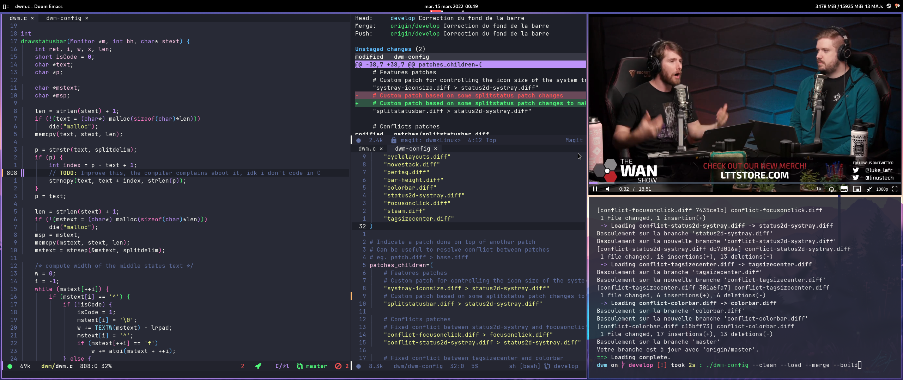
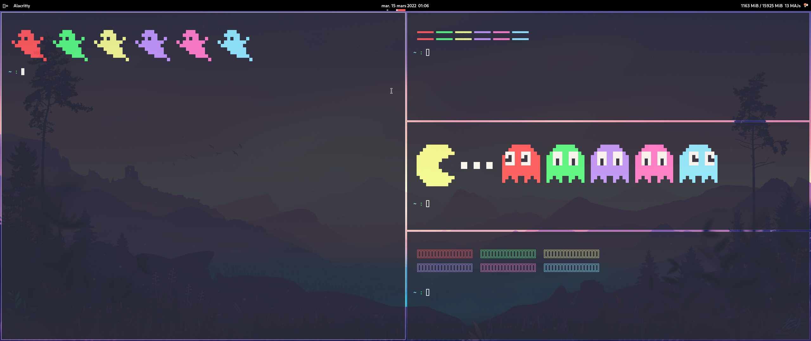

**Smells worse over here than a dozen of rotten eggs dropped in a vat of vinegar.**

Fear the glorious dotfiles, they are so specific, they can melt the repository servers down each time the install script is executed.

This is my personal configuration files.

